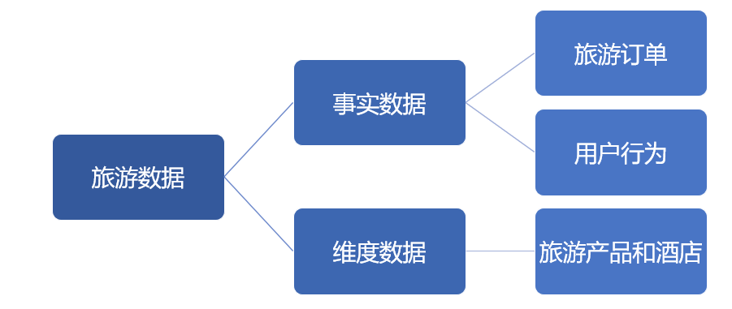
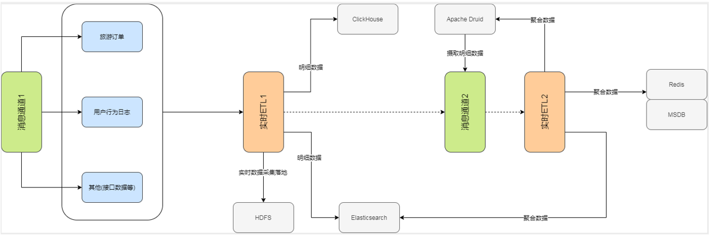

# 实时大数据旅游平台
## 1. 简介
### 1.1 数据

- 事实数据由代码模拟生成，并让kafka消费
- 维度数据由建表语句生成，并导入mysql存储
## 2. 工具
|Tools|Version|
|-|-|
|hadoop|2.7.6|
|kafka|1.1.1|
|zookeeper|3.4.10|
|flink|1.9.1|
|redis|4.0.11|
|elasticsearch|6.5.3|
|mysql|5.7.18|
## 3. 项目需求
1) 将订单明细数据通过Kafka实时打入hdfs中，以便离线的订单指标分析。
2) 实时ETL将用户点击行为数据、用户页面浏览行为数据、浏览产品列表数据打入ES或者kafka的dw层。
3) 实时ETL将订单数据形成宽表打入ES或者kafka中
4) 针对dw层的订单数据进行实时聚合计算分析并存储到ES或者kafka中
5) 对用户浏览异常行为进行实时监控-CEP

### 3.1 实时ETL(filter, flatMap)
1) 将订单明细数据实时ETL打入hdfs
    - 以parquet格式存储到hdfs中
    - 路径为hdfs://host:port/项目名/表名/分桶文件数据
    - 供离线数仓部分使用

2) 用户交互行为点击事件明细数据实时ETL后打入ES 
    - 过滤出action为05和event type为02的数据 
    - 设置最大乱序数据时间5s

3) 用户对页面浏览数据实时ETL
    - 主要是过滤action为07 和 08的数据
    - 将用户行为中的页面浏览数据明细--->打入ES
    - 将用户行为中的页面浏览数据dw--->打入kafka

4) 用户浏览产品列表明细数据实时ETL
    - 过滤出action为05和event type为浏览和滑动两种事件
    - 设置最大乱序数据时间5s
    - 将最终结果数据打入kafka中

5) 订单明细数据实时ETL
    - 需要和订单产品维度进行合并
    - 需要和酒店维度进行合并
    - 将合并后形成的宽表数据打入ES中
    - 将合并后形成的宽表数据打入kafka

6) 计算订单累计订单费用和订单个数
    - 不需要维度
    - 实时累计fee和orders
    - 将实时结果数据打入es中

7) 实时订单聚合结果写入redis缓存供外部系统使用
    - 数据源：travel_ods_orders
    - 根据 用户所在地区(userRegion),出游交通方式(traffic)两个维度，实时累计	计算orders, maxFee, totalFee, members
    - 并指定窗口计算上述的4个累计值
    - 聚合结果：打入redis

8) 旅游订单业务实时计算
    - 需求和ordersAggCacheHandler一模一样，，只是将结果数据打入es中
9) 基于订单数量和时间触发订单数据统计任务(OrdersStatisHandler)
    - 基于条件（订单数量）触发订单任务统计
    - 根据traffic、hourtime维度，，来统计orders、users、totalFee三个指标
    - 将结果打入es

10) 自定义状态统计订单数量和订单费用(OrdersCustomerStatisHandler)
    - 基于时间触发

11) 订单宽表数据实时统计计算(OrdersWideTimeAggHandler)
    - 基于产品类型和是否境内外游维度统计
    - 结果数据打入kafka

12) 订单实时统计并排名(OrdersTopnStatisHandler)
    - 基于窗口内的订单数据进行统计后的实时排名
    - 订单分组维度：出行方式、productID
    - 先根据订单个数，在根据订单总金额升序

13) 用户浏览行为异常告警(UserLogsViewWarnHandler)
    - 基于页面浏览异行为中的【停留时长】常报警处理
    - 告警规则：5分钟内连续连续 停留时长 小于X 大于Y 的情况出现3次以上
    - 将异常数据打入kafka中
## 3. 架构

## 4. 工具对应的业务代码
### 4.1 Kafka
1) kafka自定义序列化
### 4.2 Redis
将mysql里的维度数据取出放到redis里，然后在从redis里取数据(OrdersWideAsyncHander类)异步？
维表关联为了提升速度，常用到外部缓存，例如redis，并且使用异步操作，广播变量？？